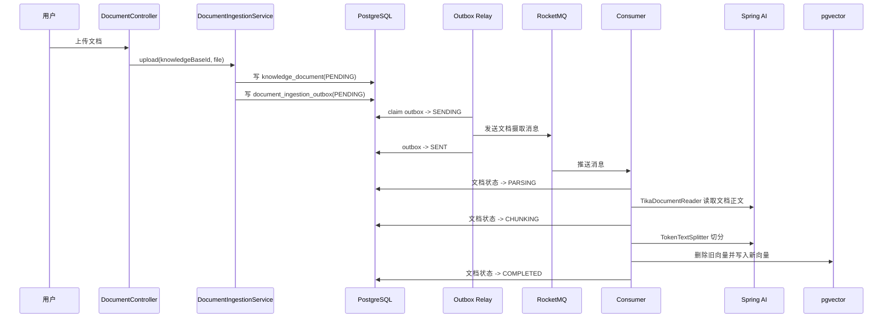
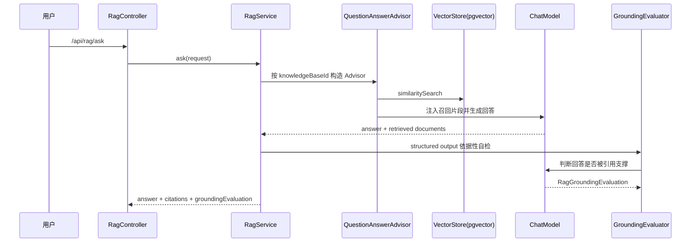
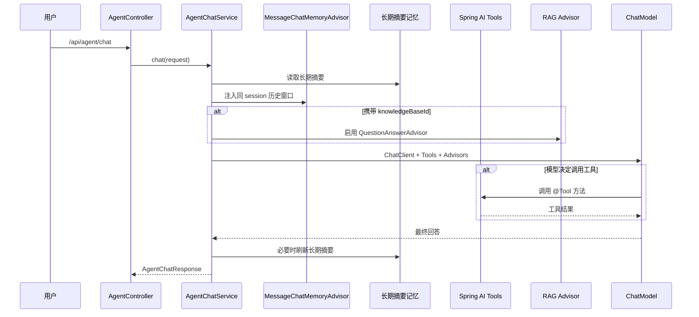

# Rain AI 后端阶段总结

本文用于阶段收口：重新梳理当前后端已经完成了什么、每个功能解决什么问题、接口之间是什么关系、表数据如何流转，以及面试时应该怎么讲。

## 一句话定位

Rain AI 是一个企业知识库 Agent 后端。它不是简单调用大模型聊天，而是把 Spring AI、RAG、Tool Calling、会话记忆、结构化输出、RocketMQ 可靠投递、pgvector 和 JDK 21 虚拟线程组合起来，解决企业文档问答和 Agent 工具执行场景。

核心能力分两层：

- RAG 能力层：负责文档读取、切分、向量化、召回、问答、引用片段和依据性自检。
- Agent 编排层：负责多轮对话、长期记忆、工具调用、可选 RAG、流式事件输出。

## 当前完成度

后端核心能力已经基本成型，可以用于本地演示和简历包装。

已完成：

- 知识库创建和列表查询。
- 文档上传、异步摄取、重新摄取。
- Spring AI Tika 文档读取。
- Spring AI TokenTextSplitter 文档切分。
- Spring AI VectorStore 写入 pgvector。
- Spring AI QuestionAnswerAdvisor 做 RAG 问答。
- RAG 回答引用片段返回。
- RAG 回答依据性自检。
- Spring AI `@Tool` 工具调用。
- Agent 普通对话和 SSE 流式对话。
- Agent 短期窗口记忆和长期摘要记忆。
- RocketMQ outbox 可靠投递。
- RocketMQ 消费侧重试、单条消费和失败终止。
- 失败文档重驱动。
- 整库批量重摄取。
- JDK 21 虚拟线程用于 MQ 投递和批量重摄取登记。

还没有做：

- 前端页面。
- 登录、权限、租户。
- 生产级观测、链路追踪、权限审计。

这些没有做是刻意取舍。当前阶段目标是求职项目的技术含量和可讲述性，不是做一个完整 SaaS。

## 接口分层

### RAG 问答接口

`POST /api/rag/ask`

定位：固定使用指定知识库做问答。

它不是通用聊天接口，而是 RAG 能力验证接口。流程固定、边界清晰：

1. 校验知识库是否存在。
2. 使用 `QuestionAnswerAdvisor` 从 `VectorStore` 召回片段。
3. 把召回内容注入 `ChatClient`。
4. 生成回答。
5. 返回引用片段。
6. 使用 Spring AI structured output 做依据性自检。

适合演示：

- 知识库问答页。
- RAG 效果调试。
- 引用片段展示。
- 幻觉控制。

### Agent 对话接口

`POST /api/agent/chat`

定位：让模型自己判断要不要调用工具、要不要结合知识库、要不要使用记忆。

它不是单纯 RAG，而是 Agent 编排入口。它可以处理这些情况：

- 用户问“有哪些知识库”：调用 `listKnowledgeBases` 工具。
- 用户问“有哪些失败文档”：调用 `listFailedDocuments` 工具。
- 用户要求“重新处理失败文档”：调用 `reingestFailedDocuments` 工具。
- 用户要求“重新处理整个知识库”：调用 `reingestAllDocuments` 工具。
- 用户传了 `knowledgeBaseId` 并提出知识库问题：同时启用 RAG Advisor。
- 用户带了 `sessionId`：注入历史会话和长期摘要记忆。

### Agent 流式接口

`POST /api/agent/chat/stream`

定位：给前端逐字展示和事件化渲染使用。

SSE 事件包括：

- `session`：本轮会话 ID。
- `delta`：模型流式输出片段。
- `citations`：RAG 场景下的引用片段。
- `done`：本轮结束。
- `error`：错误信息。

这里使用的是 Spring AI `ChatClient.stream().chatClientResponse()`，不是后端把完整字符串切碎后伪造流式。

## 文档摄取主流程



这条链路的核心价值：

- 上传接口不直接做耗时的解析和向量化，避免用户请求长时间阻塞。
- 文档记录和消息意图在同一个数据库事务提交，避免“文档有了但消息丢了”。
- RocketMQ 只负责异步执行，不承担数据库事务一致性。
- 消费者按 `document_id` 删除旧向量再写新向量，保证重复投递时结果幂等。

## RAG 问答主流程



这里有三个重点：

- 检索不是自己手写 SQL，而是交给 Spring AI `VectorStore` 和 `QuestionAnswerAdvisor`。
- 文档切分不是自己写字符串分割，而是交给 `TokenTextSplitter`。
- 回答后增加依据性自检，用 structured output 让模型输出稳定 Java record。

## Agent 编排主流程



这就是 `/api/agent/chat` 和 `/api/rag/ask` 的根本区别：

- `/api/rag/ask` 是固定 RAG 问答。
- `/api/agent/chat` 是 Agent 编排入口，RAG 只是它可以使用的一种能力。

## 核心表结构

当前表结构刻意保持克制，只保留当前功能真正需要的字段。

### knowledge_base

用途：保存知识库。

核心字段：

- `id`：知识库 ID。
- `name`：知识库名称。

为什么没有过多字段：

- 当前没有租户、权限、团队协作，所以不保留无意义字段。
- `description`、`workspace_id`、`created_at` 等历史字段已经通过迁移移除。

### knowledge_document

用途：保存上传文档的业务状态。

核心字段：

- `id`：文档 ID。
- `knowledge_base_id`：所属知识库。
- `original_filename`：原始文件名，展示和排查问题用。
- `storage_path`：本地存储路径，消费者读取文件用。
- `status`：摄取状态。
- `error_message`：失败原因。

状态流转：

```text
PENDING -> PARSING -> CHUNKING -> EMBEDDING -> COMPLETED
                              \-> FAILED
```

状态含义：

- `PENDING`：文档已经登记，等待 MQ 消费。
- `PARSING`：正在读取文件正文。
- `CHUNKING`：正在切分文档。
- `EMBEDDING`：正在调用 embedding 并写入向量库。
- `COMPLETED`：摄取完成。
- `FAILED`：摄取失败，可重新驱动。

### rain_ai_vector_store

用途：Spring AI pgvector 自动使用的向量表。

项目不自己维护 `document_chunk` 和 `embedding_record`，原因是：

- Spring AI `VectorStore` 已经负责 embedding 调用、向量写入、相似度检索。
- 项目只需要在 metadata 中保留业务约束字段。

关键 metadata：

- `knowledge_base_id`：用于限定检索范围。
- `document_id`：用于删除旧向量和返回引用。
- `chunk_index`：用于标识引用片段顺序。
- `storage_path`：用于排查来源文件。

### document_ingestion_outbox

用途：本地消息表，解决数据库事务和 RocketMQ 投递之间的一致性问题。

核心字段：

- `id`：outbox 记录 ID。
- `document_id`：要摄取的文档。
- `knowledge_base_id`：所属知识库。
- `storage_path`：消费者读取文件用。
- `status`：投递状态。
- `retry_count`：投递失败次数。
- `error_message`：投递失败原因。

状态含义：

- `PENDING`：等待投递 MQ。
- `SENDING`：已经被 relay 领取，正在投递。
- `SENT`：MQ 投递成功。
- `FAILED`：本次投递失败，可继续重试或最终失败。

为什么可以重复投递：

- outbox 可能在“MQ 已发送但 `SENT` 未写入”时因为应用宕机而重复发送。
- 消费者摄取前会按 `document_id` 删除旧向量，再写入新向量。
- 所以重复消息不会造成重复知识片段。

### agent_conversation_message

用途：持久化 Agent 原始消息流。

核心字段：

- `conversation_id`：也就是接口里的 `sessionId`。
- `message_type`：用户、助手、工具调用等消息类型。
- `content`：消息正文。
- `metadata`：Spring AI 消息元数据。
- `tool_calls`：模型发起的工具调用。
- `tool_responses`：工具响应。

这里不是 Redis 短期缓存，而是完整消息流。短期窗口只是读取策略，由 `rain.ai.agent.memory.window-size` 控制。

### agent_conversation_summary

用途：保存长期摘要记忆。

核心字段：

- `conversation_id`：会话 ID。
- `summary`：长期摘要。
- `summarized_message_id`：摘要已经覆盖到哪条消息。

为什么要有长期摘要：

- 原始消息可以永久保存。
- 模型上下文不能无限塞历史。
- 长期摘要保留稳定事实、用户偏好、已确认技术决策。

## Spring AI 使用点

### TikaDocumentReader

解决问题：上传文档不一定是纯文本，可能是 PDF、Word、HTML、TXT。

项目做法：

- 使用 Spring AI `TikaDocumentReader` 读取文件正文。
- 不自己写文件格式解析。
- 读取后补充业务 metadata。

代码入口：

- `KnowledgeDocumentReader`

面试讲法：

> 文档解析层我没有简单 `Files.readString`，而是接入 Spring AI 的 Tika reader，让 RAG 摄取链路支持多种文档格式。业务只补充知识库 ID、文档 ID 这些 metadata，具体格式解析交给成熟组件。

### TokenTextSplitter

解决问题：文档不能整篇直接 embedding，也不能用简单字符串长度硬切。

项目做法：

- 使用 Spring AI `TokenTextSplitter`。
- 配置 chunk size、最小块长度、分隔符保留策略。

代码入口：

- `SpringAiRagConfig`
- `DocumentIngestionProcessor`

面试讲法：

> 文档切分我没有手写字符串 split，而是交给 Spring AI 的 token splitter。原因是 embedding 和 LLM 上下文都按 token 工作，切分策略要尽量贴近模型输入边界。

### VectorStore + pgvector

解决问题：文档片段需要向量化和相似度检索。

项目做法：

- 使用 Spring AI `VectorStore.add` 写入。
- 使用 pgvector HNSW 索引做向量检索。
- metadata 中保留 `knowledge_base_id` 和 `document_id`。

代码入口：

- `DocumentIngestionProcessor`
- `RagRetrievalService`
- `RagAdvisorFactory`

面试讲法：

> 我把向量写入和检索抽象交给 Spring AI VectorStore，底层是 pgvector。业务层通过 metadata 做知识库隔离，不自己维护 chunk 表和 embedding 表，避免重复造轮子。

### QuestionAnswerAdvisor

解决问题：RAG 不应该手动拼一堆上下文字符串。

项目做法：

- 使用 Spring AI `QuestionAnswerAdvisor`。
- 用 filterExpression 限制知识库。
- 自定义 RAG prompt template。
- 从响应 metadata 中提取 retrieved documents 作为引用片段。

代码入口：

- `RagAdvisorFactory`
- `RagCitationMapper`
- `RagService`
- `AgentChatService`

面试讲法：

> RAG 的召回注入我使用 Spring AI Advisor 机制。这样检索、上下文注入、响应 metadata 都由框架统一处理，应用层只关心知识库过滤、提示词约束和引用结果转换。

### Structured Output

解决问题：模型输出如果是自由文本，后端难以稳定消费。

项目做法：

- 长期摘要使用 `ChatClient.entity(ConversationSummaryDraft.class)`。
- RAG 依据性自检使用 `ChatClient.entity(RagGroundingEvaluation.class)`。

代码入口：

- `AgentConversationSummaryService`
- `RagGroundingEvaluator`

面试讲法：

> 我在两个地方用了结构化输出：一个是长期记忆压缩，一个是 RAG 回答依据性自检。这样模型输出不是随意文本，而是映射成 Java record，后续业务可以稳定判断。

### Tool Calling

解决问题：Agent 不能靠关键词匹配决定操作，应该让模型根据工具描述自主调用。

项目做法：

- 使用 Spring AI `@Tool` 暴露工具。
- 使用 `ToolCallbacks.from(...)` 注册工具。
- `AgentChatService` 通过 `.toolCallbacks(...)` 交给模型调用。

当前工具：

- `listKnowledgeBases`
- `listFailedDocuments`
- `reingestFailedDocuments`
- `reingestAllDocuments`
- `searchKnowledgeBase`

代码入口：

- `KnowledgeBaseAiTools`
- `SpringAiToolCatalog`
- `AgentChatService`

面试讲法：

> 工具调用不是我自己写关键词匹配，而是通过 Spring AI 原生 tool calling。工具描述、参数 schema、调用过程都交给 Spring AI，项目只实现真实业务方法。

### MessageChatMemoryAdvisor

解决问题：Agent 多轮对话需要历史上下文，但不能每次手动拼 prompt。

项目做法：

- 实现 Spring AI `ChatMemory`。
- 使用 PostgreSQL 保存完整消息流。
- 使用 `MessageChatMemoryAdvisor` 注入最近窗口。

代码入口：

- `PostgresAgentChatMemory`
- `AgentMemoryConfig`
- `AgentChatService`

面试讲法：

> 我没有用 Redis 保存几条最近消息，而是实现 Spring AI 的 ChatMemory，把原始消息流持久化到 PostgreSQL。Advisor 负责自动注入短期窗口，长期记忆再用模型摘要压缩。

### Streaming

解决问题：AI 对话如果等完整回答返回，前端体验差。

项目做法：

- 使用 `ChatClient.stream().chatClientResponse()`。
- SSE 事件化输出 `session`、`delta`、`citations`、`done`、`error`。
- 从 Spring AI 响应 metadata 中提取 RAG 引用片段。

代码入口：

- `AgentChatService.stream`
- `AgentController.stream`
- `AgentChatStreamEvent`

面试讲法：

> 流式接口不是把完整字符串切碎，而是直接使用 Spring AI 的流式响应。并且我没有只输出 token，还把引用片段作为独立 SSE 事件返回，方便前端做回答和来源分区渲染。

## RocketMQ 和可靠性设计

### 为什么需要 MQ

文档摄取包括文件读取、文档切分、embedding 调用、向量写入。它们都可能比较慢，而且依赖外部模型服务。

如果上传接口同步完成这些操作：

- 用户请求会很慢。
- 模型服务抖动会直接影响上传接口。
- 多文档上传容易占满 Web 请求线程。

所以当前设计是：

- 上传接口只登记文档和消息意图。
- RocketMQ 异步驱动摄取。
- 用户通过文档状态观察进度。

### 为什么需要 outbox

如果数据库事务提交后才发送 MQ，可能出现：

```text
文档记录提交成功 -> 应用宕机 -> MQ 没发出去
```

结果就是文档永远 `PENDING`。

outbox 解决的是：

- 文档记录和消息意图在同一个事务提交。
- 后台 relay 定时扫描 outbox 并投递 MQ。
- 即使应用宕机，重启后仍然能继续投递。

### 消费侧设计

消费者做了这些控制：

- 单条消息消费，避免一条坏消息拖累整批。
- 配置消费线程数。
- 配置最大重试次数。
- 达到最大消费失败次数后停止 RocketMQ 反复投递。
- 消费过程失败时文档变成 `FAILED`。

### 重驱动设计

当前支持两种重驱动：

- 失败文档重驱动：只重新投递 `FAILED` 文档。
- 整库重摄取：重新投递知识库下全部文档。

适用场景：

- 文档解析临时失败。
- embedding 服务临时失败。
- 切分参数调整后需要整库重建向量。
- 模型或 embedding 版本切换后需要重新摄取。

## JDK 21 虚拟线程使用点

项目里虚拟线程不是只打开 Spring Boot 开关，而是用在了两个明确场景。

### outbox 并发投递 MQ

RocketMQ producer `send` 是阻塞式网络 IO。

项目使用：

- `Executors.newVirtualThreadPerTaskExecutor()`
- `CompletableFuture.runAsync(...)`

价值：

- 每条 outbox 投递可以独立阻塞。
- 不需要为大量阻塞 IO 准备大量平台线程。
- 更适合网络 IO 密集任务。

### 批量重摄取登记

整库重摄取时，一个知识库可能有很多文档。每个文档都要执行：

- 更新文档状态。
- 写入 outbox。

项目使用：

- 虚拟线程并发处理每个文档。
- `TransactionTemplate` 保证每个文档是独立短事务。
- `Semaphore` 控制进入数据库事务的并发上限。
- `rain.ai.knowledge.reingest-concurrency` 配置并发边界。

面试讲法：

> 虚拟线程不能无脑放开，否则数据库连接池仍然会成为瓶颈。所以我用虚拟线程承载大量轻量任务，但用 Semaphore 控制真正进入数据库事务的并发数。这样既利用了虚拟线程低成本阻塞的优势，又保留了资源边界。

## 当前可以演示的路径

### 1. 创建知识库

```bash
curl -X POST http://localhost:8080/api/knowledge-bases \
  -H "Content-Type: application/json" \
  -d "{\"name\":\"企业制度知识库\"}"
```

### 2. 上传文档

```bash
curl -X POST http://localhost:8080/api/knowledge-bases/{knowledgeBaseId}/documents \
  -F "file=@制度文档.pdf"
```

观察点：

- `knowledge_document.status` 从 `PENDING` 变成 `COMPLETED`。
- `document_ingestion_outbox.status` 变成 `SENT`。
- `rain_ai_vector_store` 写入向量片段。

### 3. 查询文档状态

```bash
curl http://localhost:8080/api/knowledge-bases/{knowledgeBaseId}/documents
```

观察点：

- 返回文档 `id`、`originalFilename`、`status`、`errorMessage`。
- 接口不暴露服务器本地 `storage_path`。
- 前端可以用这个接口展示上传后的处理进度。

### 4. RAG 问答

```bash
curl -X POST http://localhost:8080/api/rag/ask \
  -H "Content-Type: application/json" \
  -d "{\"knowledgeBaseId\":\"你的知识库ID\",\"question\":\"报销审批规则是什么？\"}"
```

观察点：

- 返回 `answer`。
- 返回 `citations`。
- 返回 `groundingEvaluation`。

### 5. Agent 工具调用

```bash
curl -X POST http://localhost:8080/api/agent/chat \
  -H "Content-Type: application/json" \
  -d "{\"message\":\"帮我列出有哪些知识库\"}"
```

观察点：

- 模型调用 `listKnowledgeBases` 工具。
- 结果不是关键词匹配，而是 Spring AI tool calling。

### 6. Agent 流式输出

```bash
curl -N -X POST http://localhost:8080/api/agent/chat/stream \
  -H "Content-Type: application/json" \
  -d "{\"knowledgeBaseId\":\"你的知识库ID\",\"message\":\"这个知识库里有什么审批规则？\"}"
```

观察点：

- 先返回 `session`。
- 中间返回多个 `delta`。
- RAG 场景返回 `citations`。
- 最后返回 `done`。

### 7. 重驱动失败文档

```bash
curl -X POST http://localhost:8080/api/knowledge-bases/{knowledgeBaseId}/documents/failed/reingest
```

### 8. 整库重摄取

```bash
curl -X POST http://localhost:8080/api/knowledge-bases/{knowledgeBaseId}/documents/reingest
```

## 简历写法

可以写成：

> 基于 Spring Boot 3.5、JDK 21、Spring AI、PostgreSQL/pgvector 和 RocketMQ 实现企业知识库 Agent 后端。文档摄取链路使用 Spring AI TikaDocumentReader、TokenTextSplitter 和 VectorStore 完成多格式解析、Token 切分和向量入库；问答链路基于 QuestionAnswerAdvisor 实现 RAG 上下文注入，并通过 structured output 做回答依据性自检。Agent 层接入 Spring AI `@Tool`、MessageChatMemoryAdvisor 和 SSE 流式输出，支持工具调用、多轮记忆、RAG 引用片段事件化返回。文档异步摄取采用 outbox + RocketMQ 解决数据库事务与消息投递一致性问题，消费侧支持单条消费、最大重试和失败重驱动；批量重摄取使用 JDK 21 虚拟线程配合 Semaphore 控制数据库并发边界。

## 面试问答准备

### 你这个项目不是简单调大模型吗？

不是。简单调模型只是传 prompt 拿回答。这个项目把模型放在企业知识库场景里，做了文档摄取、向量检索、RAG Advisor、工具调用、记忆、结构化输出、流式事件、异步消息可靠性和重驱动。

### 为什么不用自己写 Prompt Engine？

因为 Spring AI 已经提供 `ChatClient`、Advisor、Tool Calling 和 Memory。项目重点不是重复造一套小框架，而是把这些框架能力用在正确的位置，并保留业务约束。

### 为什么 RAG 和 Agent 分两个接口？

RAG 是能力层，负责基于指定知识库问答。Agent 是编排层，负责理解用户意图并决定是否调用工具、是否使用 RAG、是否结合记忆。拆开后 RAG 可以单独验证，Agent 可以展示编排能力。

### 为什么要做依据性自检？

RAG 仍可能产生幻觉。召回片段进入上下文不等于回答一定被片段支撑，所以回答后再用 structured output 审查是否有无依据结论。这样前端或业务侧可以根据 `grounded` 做提示。

### 为什么不用 Redis 做记忆？

Redis 更适合缓存和短期高频读写。当前项目的记忆需要长期保存、可追溯和可压缩，所以原始消息流放 PostgreSQL；上下文窗口由 ChatMemory 控制，长期摘要由模型压缩生成。

### 为什么需要 RocketMQ？

文档摄取是耗时、依赖外部模型服务的异步任务。MQ 把上传请求和摄取执行解耦，让上传接口快速返回，同时支持失败重试、削峰和重驱动。

### 为什么需要 outbox？

只在事务提交后直接发 MQ 会有消息丢失窗口。outbox 把“要发消息”这件事也写入数据库事务，保证文档记录和消息意图同时提交。

### 虚拟线程用在哪里？

两个地方：outbox 并发投递 MQ、批量重摄取登记。它们都是阻塞 IO 或短事务调度场景，适合虚拟线程。但项目也用 Semaphore 控制数据库并发，避免虚拟线程无边界压垮连接池。

## 后端剩余建议

后端可以继续做，但不建议无限加功能。优先级如下：

1. 补一份接口调用脚本或 Postman 集合，方便演示。
2. 前端实现知识库、文档上传、RAG 问答、Agent Chat、失败重驱动页面。
3. 最后整理简历描述和项目答辩稿。

当前后端已经具备求职项目的主要技术抓手，后续重点应该从“继续堆功能”转向“把功能讲透、演示顺畅、前端能用”。
